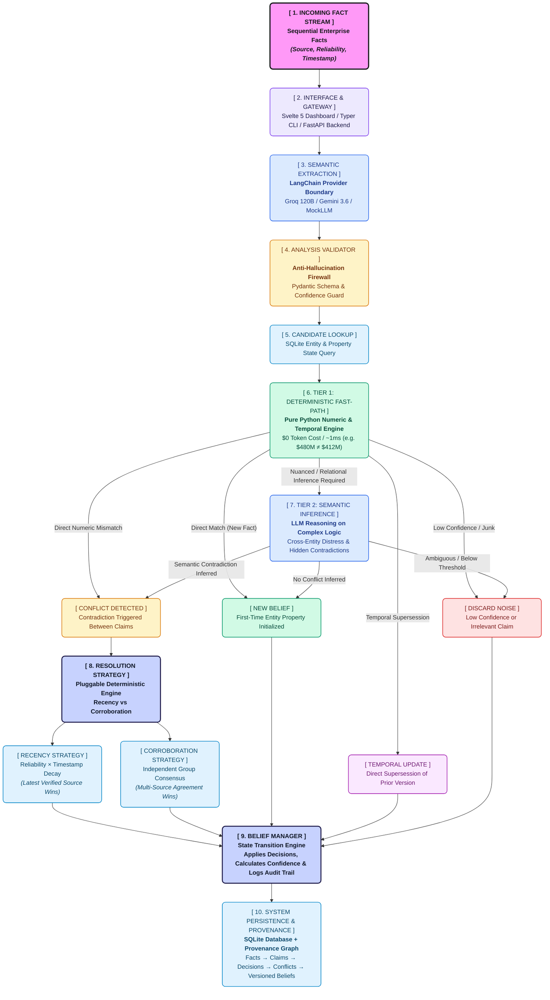

# Jnaara — The Contradicting Memory

> **The LLM interprets information. The deterministic engine maintains belief.**

Jnaara is an auditable belief engine that ingests sequential facts about entities, detects contradictions (both direct and inference-based), resolves conflicts using swappable strategies, and maintains persistent belief state with full provenance tracking.

This is not a vector database or an LLM wrapper. It is a **memory system** that tracks what it believes, what evidence supports or contradicts each belief, how beliefs evolved over time, and why a particular resolution was chosen.

---

## Problem Statement

**Problem C: The Contradicting Memory** — Given a stream of facts from multiple sources with varying reliability, build a system that:

1. Extracts structured claims from unstructured text
2. Detects contradictions — both obvious and inference-based
3. Resolves conflicts using pluggable, deterministic strategies
4. Maintains an auditable trail of every belief change

The system is tested against **5 sequences of increasing difficulty** (138 facts total across 15 enterprise entities):

| Sequence | Difficulty | What It Tests | Detection Rate | Resolution Accuracy |
|---|---|---|:---:|:---:|
| **Sequence 1** | **Easy** | Clear contradictions — revenue restatements, CEO changes, facility counts | **100% (5/5)** | **100%** |
| **Sequence 2** | **Medium** | Partial updates, conflicting sources, cross-entity partner dependencies | **100% (4/4)** | **100%** |
| **Sequence 3** | **Hard** | Logical incompatibilities, supply chain friction, clinical trial crossover bias | **100% (4/4)** | **100%** |
| **Sequence 4** | **Hard** | FinTech asset quality, stablecoin reserve duration mismatch, loan default hedging | **100% (3/3)** | **100%** |
| **Sequence 5** | **Hard** | Cybersecurity breach denial vs packet captures, five-nines SLAs, telemetry training | **100% (3/3)** | **100%** |
| **Overall** | **Benchmark** | **All 138 Facts across 15 Companies (286 Extracted Claims)** | **100% (19/19)** | **100%** |

👉 **Full Detailed Benchmark Report:** [docs/ACCURACY_AND_BENCHMARKS.md](docs/ACCURACY_AND_BENCHMARKS.md)

---

## Architecture



### Core Architectural Principle

The **LLM** is responsible for semantic understanding:
- Claim extraction and normalization
- Entity/attribute/value interpretation
- Inference-based contradiction detection

The **deterministic Python backend** owns all state:
- Belief state transitions
- Conflict resolution
- Confidence calculation
- Provenance and audit history
- Persistence

The LLM never modifies beliefs or writes to the database directly.

---

## Tech Stack

| Layer | Technology | Why |
|---|---|---|
| Language | Python 3.12+ | Strong backend ecosystem |
| Data validation | Pydantic v2 | Typed Fact, Belief, Conflict, Decision models |
| LLM abstraction | LangChain | Common interface for Groq + Gemini |
| LLM (primary) | Groq (`openai/gpt-oss-120b`) | Fast inference, reasoning-capable |
| LLM (secondary) | Google Gemini (`gemini-3.6-flash`) | Independent provider for fallback/second opinion |
| Conflict resolution | Strategy Pattern | Pluggable, deterministic, auditable |
| Database | SQLite + SQLAlchemy | Persistent beliefs, facts, conflicts, provenance |
| CLI | Typer + Rich | Interactive commands with formatted output |
| Testing | pytest | Unit + integration with mock LLM providers |
| Configuration | pydantic-settings + .env | API keys, model configuration |
| Package management | uv | Fast, modern Python dependency management |

---

## Project Structure

```
jnaara-poc/
├── pyproject.toml
├── .env.example
├── README.md
│
├── data/
│   └── jnaara_memory_facts_dataset.json
│
├── docs/
│   ├── ACCURACY_AND_BENCHMARKS.md # Benchmark accuracy analysis (100% on 3 sequences)
│   ├── EVALUATION_RESULTS.md      # Detailed evaluation runs & metrics
│   ├── architecture.md
│   ├── AI_DEVELOPMENT_LOG.md
│   └── ARCHITECTURE_DECISIONS.md
│
├── src/
│   └── jnaara/
│       ├── config.py
│       ├── models/
│       │   ├── domain.py          # Pydantic v2 domain models
│       │   └── db.py              # SQLAlchemy ORM models
│       ├── db/
│       │   ├── engine.py          # Database setup
│       │   └── repository.py      # CRUD operations
│       ├── ingestion/
│       │   └── ingestor.py        # JSON parsing + fact loading
│       ├── analysis/
│       │   ├── semantic.py        # LLM-powered semantic analyzer
│       │   ├── prompts.py         # Prompt templates
│       │   └── validator.py       # LLM output validation
│       ├── llm/
│       │   ├── provider.py        # LLMProvider ABC
│       │   ├── groq.py            # Groq provider
│       │   ├── gemini.py          # Gemini provider
│       │   └── factory.py         # Provider factory
│       ├── conflict/
│       │   ├── detector.py        # Two-tier conflict detection
│       │   ├── resolver.py        # Conflict resolver orchestrator
│       │   └── strategies/
│       │       ├── base.py        # ResolutionStrategy ABC
│       │       ├── recency.py     # Recency-weighted strategy
│       │       └── corroboration.py  # Corroboration-weighted strategy
│       ├── belief/
│       │   └── manager.py         # Belief lifecycle management
│       └── cli/
│           └── app.py             # Typer CLI
│
└── tests/
    ├── test_models.py
    ├── test_ingestion.py
    ├── test_conflict_detection.py
    ├── test_conflict_resolution.py
    ├── test_belief_manager.py
    └── test_integration.py
```

---

## Setup & Installation

### Prerequisites

- **Python 3.12+** and [**uv**](https://docs.astral.sh/uv/) package manager
- **Node.js 18+** and **npm** (for the web frontend)
- *Optional:* Groq / Google Gemini API keys for live LLM inference (the system includes deterministic mock providers for offline development and test execution)

### 1. Backend Setup

```bash
# Clone the repository
git clone https://github.com/sharan1918/Jnaara-poc.git
cd Jnaara-poc

# Install Python backend dependencies
uv sync

# Configure environment variables
cp .env.example .env
# Edit .env with your API keys and model preferences (optional for mock mode)
```

#### Running the Backend API Server

Start the FastAPI REST backend server:

```bash
# From the project root:
uv run uvicorn jnaara.api.main:app --reload --port 8000
```

- **Backend API URL:** `http://localhost:8000`
- **Interactive OpenAPI / Swagger Docs:** `http://localhost:8000/docs`
- **Health Check Endpoint:** `http://localhost:8000/health`

---

### 2. Frontend (Web UI) Setup

The web dashboard is an interactive visual interface with real-time sequence ingestion, step-by-step belief timeline player, provenance graph visualization, and strategy switching.

```bash
# Navigate to the web frontend directory
cd web

# Install Node.js frontend dependencies
npm install

# Start the Vite development server
npm run dev
```

- **Web Dashboard URL:** `http://localhost:5173` (or the port displayed in your terminal)
- **Production Build:** `npm run build`

---

### 3. Configuration (.env)

```env
JNAARA_GROQ_API_KEY=gsk_...
JNAARA_GOOGLE_API_KEY=AIza...
JNAARA_PRIMARY_LLM=groq
JNAARA_PRIMARY_MODEL=openai/gpt-oss-120b
JNAARA_SECONDARY_LLM=gemini
JNAARA_SECONDARY_MODEL=gemini-3.6-flash
JNAARA_DB_PATH=data/jnaara.db
JNAARA_DEFAULT_STRATEGY=recency
```

---

## CLI Usage

You can also interact with the belief engine directly via the Typer CLI:

### Ingest Facts

```bash
# Ingest a specific sequence (e.g. sequence 1, 2, 3, 4, or 5)
jnaara ingest data/jnaara_memory_facts_dataset.json --sequence sequence_1_easy

# Ingest all sequences
jnaara ingest data/jnaara_memory_facts_dataset.json --sequence all
```

### Query Beliefs

```bash
# View all active beliefs
jnaara beliefs

# Filter by entity
jnaara beliefs --entity "NovaTech Inc."
```

### View Conflicts

```bash
# View all detected conflicts and their resolutions
jnaara conflicts

# Filter by entity
jnaara conflicts --entity "NovaTech Inc."
```

### Provenance

```bash
# Trace the full history of a belief
jnaara provenance <belief-id>
```

### Strategy Switching

The system supports pluggable conflict resolution strategies. Switching strategies changes how the system resolves contradictions, producing different belief states from the same data:

```bash
# Run with recency-weighted strategy
jnaara strategy recency
jnaara ingest data/jnaara_memory_facts_dataset.json --sequence sequence_1_easy
jnaara beliefs --entity "NovaTech Inc."

# Reset and run with corroboration-weighted strategy
jnaara reset
jnaara strategy corroboration
jnaara ingest data/jnaara_memory_facts_dataset.json --sequence sequence_1_easy
jnaara beliefs --entity "NovaTech Inc."
```

**Example: NovaTech enterprise customer count**

Multiple sources report different customer counts with varying reliability:

| Fact | Source | Reliability | Value |
|---|---|---|---|
| E4/E10 | Official filings | High | 340 |
| E12 | Anonymous blog | Low | ~200 |
| E22 | Press release | High | 312 |
| E26 | New CEO statement | High | 298 |

- **Recency strategy** → Believes 298 (E26 is the most recent high-reliability source)
- **Corroboration strategy** → May differ based on independent source diversity

### Other Commands

```bash
jnaara summary    # Stats dashboard: facts, beliefs, conflicts, resolutions
jnaara strategy   # Show currently active strategy
jnaara reset      # Reset database and start fresh
```

---

## Key Design Decisions

### Two-Tier Conflict Detection

- **Tier 1 (Deterministic)**: Handles obvious cases without LLM calls — same entity, same attribute, different quantitative values. No need to ask an LLM whether `$480M ≠ $412M`.
- **Tier 2 (LLM Inference)**: For nuanced cases requiring semantic reasoning — cross-entity relationships, multi-fact logical incompatibilities, Sequence 3 challenges.

### Decision Model

Every incoming claim produces a first-class `Decision` record:

```
NEW_BELIEF      — No prior belief exists
UPDATE          — Temporal supersession of existing belief
CONFLICT        — Contradiction detected, resolution required
DISCARD_NOISE   — Irrelevant or low-confidence claim
```

### Provenance Chain

Every belief is fully traceable:

```
Fact → Claim → Decision → Conflict → Resolution → Belief Version
```

### Analysis Validation

LLM output is validated before reaching business logic. A valid JSON response from an LLM is not automatically a valid business input.

---

## Testing

```bash
# Run all tests
pytest tests/ -v

# Run integration tests only
pytest tests/test_integration.py -v
```

All tests use `MockLLMProvider` — no live LLM calls required for the test suite.

---

## Development Roadmap

### Core (Priority)

- [x] Project structure and configuration
- [x] Pydantic v2 domain models
- [x] SQLite database layer
- [x] LLM provider abstraction (Groq + Gemini with rate limiting & backoff retry)
- [x] Semantic claim extraction
- [x] Analysis validation
- [x] Two-tier conflict detection
- [x] Resolution strategies (Recency + Corroboration)
- [x] Belief manager orchestration
- [x] Provenance and audit trail
- [x] Typer CLI (`ingest`, `beliefs`, `conflicts`, `provenance`, `strategy`, `summary`)
- [x] 42 Unit and integration tests with 100% pass rate
- [x] Sequence 1–3 benchmark accuracy validation (100%)

### Stretch & Production Additions

- [x] FastAPI REST API with security rate limiter and CORS
- [x] Interactive Svelte Web Dashboard with provenance trees & strategy switcher
- [x] JSON evaluation report generation to `output/`
- [x] LLM Rate Limiting, Inter-Fact Pacing & Exponential Backoff Retry

---

## License

This project is part of a take-home assignment for Jnaara.
