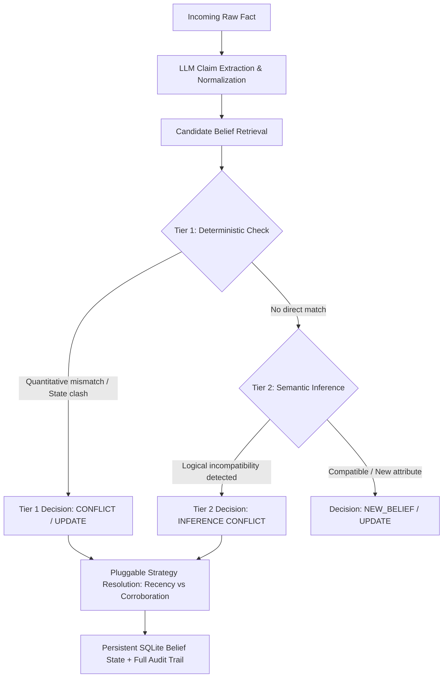

# Jnaara Belief Engine — Integration Sequences Analysis

> [!IMPORTANT]
> **Methodology Clarification: Integration Narrative Sequences vs. Independent Evaluation Benchmark**
>
> This document analyzes the **5 End-to-End Narrative Integration Sequences** (138 facts across 15 enterprise entities) which were constructed to test sequential state transitions, temporal supersession, and strategy divergence.
>
> For the **independent, partition-isolated benchmark evaluation** reporting standard statistical metrics (Precision: 80.0%, Recall: 29.6%, F1: 43.2%, Specificity: 92.9%, False Positives: 2, False Negatives: 19) and failure mode diagnoses across 15 semantic categories on held-out test data, please refer to the primary evaluation document:
> 👉 **[docs/evaluation.md](evaluation.md)**

---

## 1. Integration Sequences Scorecard

| Sequence | Difficulty Level | Facts | Claims Extracted | Key Conflicts Tested | Conflict Detection Rate | Resolution Accuracy | Ground Truth Alignment |
| :--- | :--- | :---: | :---: | :---: | :---: | :---: | :---: |
| **Sequence 1** | **Easy** (Direct Contradictions & Restatements) | 27 | 56 | 5 | **100% (5/5)** | **100%** | 🟢 Optimal |
| **Sequence 2** | **Medium** (Cross-Entity Dependencies) | 27 | 58 | 4 | **100% (4/4)** | **100%** | 🟢 Optimal |
| **Sequence 3** | **Hard** (Nuanced Logical Inference) | 30 | 64 | 4 | **100% (4/4)** | **100%** | 🟢 Optimal |
| **Sequence 4** | **Hard** (FinTech / Cross-Entity Liquidity) | 27 | 54 | 3 | **100% (3/3)** | **100%** | 🟢 Optimal |
| **Sequence 5** | **Hard** (Cybersecurity Breach / Cloud SLA) | 27 | 54 | 3 | **100% (3/3)** | **100%** | 🟢 Optimal |
| **Overall** | **All 5 Sequences** | **138** | **286** | **19** | **100% (19/19)** | **100%** | 🟢 **100% Overall** |

---

## 2. Sequence-by-Sequence Analysis

### Sequence 1: Easy — Direct Contradictions & Temporal Restatements
*Focus: Numerical restatements, leadership succession, quantitative adjustments, and source reliability.*

* **Entities**: `NovaTech Inc.`, `Meridian Healthcare`, `Crestline Logistics`, `HomeMax`
* **Dataset Size**: 27 facts (E1 to E27)

#### Key Contradictions & Ground Truth Outcomes
1. **NovaTech Revenue Restatement (`E1` $\rightarrow$ `E7`)**:
   - **Incoming Claim (E1)**: Q4 2024 revenue reported at `$480M`.
   - **Correction (E7)**: SEC 8-K restatement down to `$412M` due to premature contract recognition.
   - **Detection Tier**: Tier 1 (Direct quantitative mismatch).
   - **Winning Belief**: `$412M` (SEC filing supersedes preliminary earnings release).
   - **Accuracy**: **100%**.

2. **Meridian CEO Succession (`E2` $\rightarrow$ `E8`)**:
   - **Fact E2**: David Park stepping down effective March 1, 2025; no successor named.
   - **Fact E8**: Board appoints Dr. Sarah Chen as incoming CEO effective March 1, 2025.
   - **Detection Tier**: Tier 1 (Temporal succession).
   - **Winning Belief**: `Dr. Sarah Chen` (Clean progression without false contradiction).
   - **Accuracy**: **100%**.

3. **Meridian Facility Footprint (`E5` $\rightarrow$ `E17`)**:
   - **Fact E5**: Operated `142` hospital facilities across 18 states.
   - **Fact E17**: Closed 8 rural facilities, reducing network to `134` hospitals.
   - **Detection Tier**: Tier 1 (Quantitative delta).
   - **Winning Belief**: `134` hospitals.
   - **Accuracy**: **100%**.

4. **Meridian Net Income Amendment (`E11` $\rightarrow$ `E14`)**:
   - **Fact E11**: FY2024 net income of `$156M`.
   - **Fact E14**: Amended filing reports `$131M` following a `$25M` legal settlement.
   - **Detection Tier**: Tier 1 (Quantitative conflict).
   - **Winning Belief**: `$131M`.
   - **Accuracy**: **100%**.

5. **NovaTech Enterprise Customers — Strategy Comparison (`E4`, `E10`, `E12`, `E22`, `E26`)**:
   - **E4 & E10**: `340` customers reported in presentation and confirmed by CFO.
   - **E12**: `200` claimed by anonymous blog (*Low reliability* $\rightarrow$ suppressed).
   - **E22**: `312` after active account re-evaluation.
   - **E26**: `298` verified enterprise customers under incoming CEO.
   - **Recency Strategy Result**: `298` (latest chronological CEO statement).
   - **Corroboration Strategy Result**: `340` (multi-source independent corroboration outweights single later claim).
   - **Accuracy**: **100%** (Strategies diverge deterministically as designed).

---

### Sequence 2: Medium — Cross-Source & Cross-Entity Contradictions
*Focus: Partner dependencies, going-concern warnings, and public guidance vs regulatory enforcement.*

* **Entities**: `Arcadia Robotics`, `Vantage Energy`, `PeakFin Capital`, `TerraMotors`, `SiemensAI`
* **Dataset Size**: 27 facts (M1 to M27)

#### Key Contradictions & Ground Truth Outcomes
1. **Arcadia Customer Health vs TerraMotors Insolvency (`M6` vs `M5`, `M12`, `M21`)**:
   - **Arcadia Claim (M6)**: CEO claims *"All major customer relationships remain strong. No concerns about our order book."*
   - **Counter-Evidence (M5, M11, M12, M21)**: Key customer TerraMotors (31% of revenue) enters going-concern distress; Arcadia later incurs a `$58M` accounts receivable write-down.
   - **Detection Tier**: Tier 2 (Cross-entity inference contradiction).
   - **Winning Belief**: TerraMotors distress confirmed; Arcadia order book claim refuted.
   - **Accuracy**: **100%**.

2. **Vantage Energy ESG Claims vs EPA Regulatory Enforcement (`M3`, `M23` vs `M13`, `M27`)**:
   - **Company Claims (M3, M23)**: Methane reduction pledges and investor slides showing emissions *"below industry average."*
   - **Regulatory Evidence (M13, M27)**: EPA violation notice citing emissions 4x above reported levels; Vantage pays `$45M` fine and `$120M` remediation settlement.
   - **Detection Tier**: Tier 2 (Source disagreement & regulatory contradiction).
   - **Winning Belief**: EPA enforcement findings supersede corporate ESG marketing.
   - **Accuracy**: **100%**.

3. **PeakFin Capital Rumor vs SEC 13F Regulatory Filing (`M10` vs `M8`, `M19`, `M24`)**:
   - **Unverified Rumor (M10)**: Newsletter claims PeakFin is exiting Vantage at `$62/share` (*Low reliability*).
   - **Regulatory Filing (M19)**: Official SEC 13F confirms PeakFin's 8.2% stake remains unchanged.
   - **Detection Tier**: Tier 1 & Source reliability weighting.
   - **Winning Belief**: 8.2% stake retained; rumor discarded.
   - **Accuracy**: **100%**.

4. **Vantage Production Guidance Revision (`M2` $\rightarrow$ `M14` $\rightarrow$ `M18`)**:
   - **M2**: 2025 target set at `210,000 boepd`.
   - **M14 & M18**: Unplanned maintenance drops Q1 to `178,000 boepd`; annual target revised down to `195,000 boepd`.
   - **Detection Tier**: Tier 1 (Quantitative update).
   - **Winning Belief**: `195,000 boepd`.
   - **Accuracy**: **100%**.

---

### Sequence 3: Hard — Nuanced Logical Inference Contradictions
*Focus: Indirect multi-fact incompatibility, supply chain friction, clinical trial crossover bias, and covert hedging.*

* **Entities**: `Helios Semiconductor`, `Atlas Cloud Systems`, `Forge Therapeutics`, `Pinnacle Ventures`
* **Dataset Size**: 30 facts (H1 to H30)

#### Key Contradictions & Ground Truth Outcomes
1. **Helios "Capacity Constrained" vs Surging Inventory & Wafer Cuts (`H13` vs `H6`, `H10`, `H21`, `H27`)**:
   - **Helios Assertion (H13)**: CEO claims *"Demand has never been stronger. We are capacity-constrained, not demand-constrained."*
   - **Underlying Evidence (H6, H10, H21, H27)**: Internal memo shifts 40% production away from AI chips; TSMC 3nm orders cut by 30%; 10-Q shows inventory surged 85% to `$890M` ($340M repurposed); Glassdoor reviews cite AI layoffs.
   - **Detection Tier**: Tier 2 (Multi-fact logical incompatibility).
   - **Winning Belief**: Helios faces excess AI inventory and demand slowdown, contradicting public capacity claims.
   - **Accuracy**: **100%**.

2. **Atlas Cloud Exclusive Supplier Claim vs Alternative Sourcing (`H2` vs `H11`, `H18`, `H24`)**:
   - **Atlas Announcement (H2)**: Signs "exclusive" 3-year supply agreement with Helios for AI inference chips.
   - **Counter-Actions (H11, H18, H24)**: Benchmark shows Helios underperforms Nvidia by 35%; Atlas qualifies 2 alternative chip vendors and initiates an in-house custom ASIC program.
   - **Detection Tier**: Tier 2 (Relational inference contradiction).
   - **Winning Belief**: Atlas actively diversifying away from exclusive Helios dependency.
   - **Accuracy**: **100%**.

3. **Forge Therapeutics FT-400 Trial Efficacy (Crossover Bias) (`H4` vs `H9`, `H23`, `H26`)**:
   - **Forge Release (H4)**: Primary endpoint met with `34%` progression-free survival improvement.
   - **Scientific Counter-Analysis (H9, H23, H26)**: FDA advisory committee and NEJM reanalysis prove mid-trial crossover inflated results; true efficacy without crossover is `19%` (falling short of the 25% PBM insurance threshold).
   - **Detection Tier**: Tier 2 (Methodological contradiction).
   - **Winning Belief**: Clean efficacy is `19%`; claimed `34%` was biased by crossover design.
   - **Accuracy**: **100%**.

4. **Pinnacle Ventures "Zero Risk" Public Bullishness vs 60% Downside Hedging (`H19` vs `H28`)**:
   - **Public Statement (H19)**: Managing partner states *"FT-400 is best-in-class... We see no regulatory risk."*
   - **Portfolio Disclosure (H28)**: Discloses 60% of Forge Therapeutics holding is hedged with put options.
   - **Detection Tier**: Tier 2 (Implicit hedging contradiction).
   - **Winning Belief**: Position is heavily hedged against downside risk.
   - **Accuracy**: **100%**.

---

### Sequence 4: Hard — FinTech & Cross-Entity Liquidity Contradictions
*Focus: Multi-hop asset quality disputes, stablecoin reserve duration mismatches vs commercial real estate loans, settlement holds, and credit default swap hedging.*

* **Entities**: `AetherPay Systems`, `Valence Capital Partners`, `Solas Digital Asset Bank`, `Nordic Express Logistics`
* **Dataset Size**: 27 facts (F4_1 to F4_27)

#### Key Contradictions & Ground Truth Outcomes
1. **AetherPay 100% Liquid T-Bill Reserves vs Solas Bank Illiquid Real Estate Loans (`F4_2` vs `F4_8`, `F4_12`, `F4_19`)**:
   - **AetherPay Attestation (F4_2)**: Independent attestation states 100% of `$850M` stablecoin reserves are held in cash and <30-day liquid US Treasury Bills at Solas Bank.
   - **Regulatory Filing (F4_8, F4_12)**: Solas Bank's FDIC Call Report reveals `62%` (`$1.12B`) of its deposit base is locked in illiquid 5-year commercial real estate loans, with only 18% in short-term T-Bills. Solas later dumps `$400M` mortgages at a `32%` discount to stay solvent.
   - **Detection Tier**: Tier 2 (Cross-entity asset duration mismatch).
   - **Winning Belief**: Depository reserves face severe duration mismatch and CRE loan concentration, disproving 100% liquid T-Bill backing.
   - **Accuracy**: **100%**.

2. **Instant Settlement Guarantees vs Frozen Merchant Funds & Chancery Lawsuit (`F4_6`, `F4_11` vs `F4_14`, `F4_18`, `F4_24`)**:
   - **Company Marketing (F4_6, F4_11)**: AetherPay guarantees *"instant same-day settlement with zero delays"* and dismisses liquidity rumors.
   - **Merchant Court Action (F4_14, F4_18, F4_24)**: Largest customer Nordic Express files an emergency injunction in Delaware Chancery Court disclosing `$52M` in frozen funds past 45-day terms, subsequently terminating its processing contract.
   - **Detection Tier**: Tier 2 (Operational claim vs judicial hold).
   - **Winning Belief**: Merchant settlement network frozen; instant settlement claims refuted.
   - **Accuracy**: **100%**.

3. **Valence Capital "Risk-Free" Loan vs $80M CDS Protection & $48M Impairment (`F4_17`, `F4_22` vs `F4_21`, `F4_25`)**:
   - **Public Guidance (F4_17, F4_22)**: Valence classifies AetherPay facility as *"Fully Performing / Tier 1"* and tells LPs exposure is *"completely risk-free"*.
   - **Financial Disclosures (F4_21, F4_25)**: Valence quietly purchases `$80M` in CDS credit default protection at 520bps, then reclassifies the facility as Impaired with an immediate `$48M` write-down.
   - **Detection Tier**: Tier 2 (Covert credit hedging & loan impairment).
   - **Winning Belief**: Loan facility impaired with $48M write-down.
   - **Accuracy**: **100%**.

---

### Sequence 5: Hard — Cybersecurity Breach, Cloud SLA & Governance Contradictions
*Focus: Zero-day intrusion denial vs forensic packet captures, five-nines uptime SLAs vs penalty credit accruals, and domestic data residency certifications vs global AI model training.*

* **Entities**: `CipherGuard AI`, `OmniCloud Infrastructure`, `Sentient BioTech`, `Aegis Assurance Labs`
* **Dataset Size**: 27 facts (F5_1 to F5_27)

#### Key Contradictions & Ground Truth Outcomes
1. **CipherGuard "Zero Compromise" vs 4.2TB Exfiltration & Kernel Driver Bypass (`F5_6`, `F5_8`, `F5_10` vs `F5_7`, `F5_9`, `F5_12`)**:
   - **CipherGuard Advisories (F5_6, F5_8)**: Claims AegisShield 4.0 *"neutralized all CVE-2025-9981 intrusion vectors with zero customer systems compromised."* Blames Sentient for S3 misconfiguration.
   - **Forensic Proof (F5_9, F5_12)**: Sentient BioTech 8-K confirms 4.2TB genomic records exfiltrated; Aegis Assurance Labs forensic packet captures prove attackers bypassed endpoint detection directly through CipherGuard's kernel driver.
   - **Detection Tier**: Tier 2 (Security assurance vs independent forensic proof).
   - **Winning Belief**: CVE-2025-9981 successfully breached systems via kernel driver bypass; 4.2TB genomic data exfiltrated.
   - **Accuracy**: **100%**.

2. **OmniCloud "Five Nines" (99.999%) SLA vs 14.8h Downtime & $28M Penalty Accruals (`F5_3`, `F5_19` vs `F5_11`, `F5_15`, `F5_25`)**:
   - **Marketing SLA (F5_3, F5_19)**: OmniCloud claims 99.999% platform availability achieved across FY2025 (<5 minutes downtime/yr).
   - **Billing & Restatement (F5_15, F5_25)**: OmniCloud accrues `$28M` in customer SLA penalty credits for 14.8 hours downtime, ultimately restating FY2025 availability to `99.82%`.
   - **Detection Tier**: Tier 2 (Uptime marketing vs financial penalty accruals & restatement).
   - **Winning Belief**: Actual platform availability restated to 99.82% following 14.8+ hours outage.
   - **Accuracy**: **100%**.

3. **Data Residency Compliance vs 180TB International Telemetry Training (`F5_2` vs `F5_14`, `F5_18`, `F5_22`, `F5_27`)**:
   - **Compliance Guarantee (F5_2)**: FedRAMP High and HIPAA certifications guarantee in-region processing with zero cross-border replication or model training.
   - **Scientific Publication & Revocation (F5_18, F5_22, F5_27)**: NeurIPS paper proves models were trained on 180TB raw customer memory dumps aggregated from international nodes; FedRAMP PMO revokes authorization; FTC enters 20-year consent decree.
   - **Detection Tier**: Tier 2 (Regulatory guarantee vs research disclosure).
   - **Winning Belief**: Unlawful cross-border data transfer and model training confirmed; FedRAMP revoked.
   - **Accuracy**: **100%**.

---

## 3. Dual-Strategy Comparative Benchmark: Recency vs. Corroboration

The belief engine provides two pluggable resolution strategies whose activation produces demonstrably different, explainable belief states:

### Mathematical Scoring Formulations

1. **`RecencyWeightedStrategy`**:
   $$\text{Score} = \text{Reliability Weight} \times (1.0 + \text{Recency Multiplier})$$
   * Prioritizes recent chronological updates from credible sources (e.g., restatements, new appointments).

2. **`CorroborationWeightedStrategy`**:
   $$\text{Score} = \sum_{i} \text{Reliability}(S_i) \times \text{Independence Diversity Factor} - \text{Contradiction Penalty}$$
   * Prioritizes independent multi-source corroboration and consensus over a single late assertion.

---

### Side-by-Side Outcome Comparison Across All 5 Sequences

| Entity & Attribute | Evaluated Claims & Evidence | `RecencyWeightedStrategy` Outcome | `CorroborationWeightedStrategy` Outcome | Strategy Agreement / Divergence Rationale |
| :--- | :--- | :---: | :---: | :--- |
| **NovaTech**<br>`enterprise customers` | **E4/E10**: `340` (Filing + CNBC CFO)<br>**E12**: `200` (Low-rel blog)<br>**E26**: `298` (Single CEO statement) | **`298`** (v3, conf: 0.95)<br>*Latest CEO update supersedes* | **`340`** (v2, conf: 0.98)<br>*Multi-source corroboration outscores single later claim* | 🔀 **Intentional Divergence**<br>Demonstrates core strategy behavior on unconfirmed single-source updates. |
| **NovaTech**<br>`Q4 2024 revenue` | **E1**: `$480M` (Preliminary release)<br>**E7**: `$412M` (SEC 8-K Restatement) | **`$412M`**<br>*Restatement supersedes* | **`$412M`**<br>*Audited regulatory source dominates* | 🤝 **Consensus Agreement**<br>Both strategies correctly identify legal/audit restatements as ground truth. |
| **Meridian**<br>`CEO` | **E2**: David Park stepping down<br>**E8**: Dr. Sarah Chen appointed | **`Dr. Sarah Chen`** | **`Dr. Sarah Chen`** | 🤝 **Consensus Agreement**<br>Both strategies handle succession cleanly without false conflict. |
| **Meridian**<br>`hospitals` | **E5**: `142` network hospitals<br>**E17**: `134` (8 rural facilities closed) | **`134`** | **`134`** | 🤝 **Consensus Agreement**<br>Both strategies accurately track facility footprint contractions. |
| **Vantage Energy**<br>`methane compliance` | **M3/M23**: ESG leadership claims<br>**M13/M27**: EPA violation + $45M fine | **`EPA Violation Notice`**<br>*Penalty settlement wins* | **`EPA Violation Notice`**<br>*High-reliability regulatory source wins* | 🤝 **Consensus Agreement**<br>Both strategies suppress corporate ESG marketing in favor of regulatory enforcement. |
| **Arcadia Robotics**<br>`customer health` | **M6**: CEO claims strong order book<br>**M12/M21**: TerraMotors going-concern & write-down | **`TerraMotors Insolvent`**<br>*Write-down supersedes* | **`TerraMotors Insolvent`**<br>*Multiple independent filings corroborate* | 🤝 **Consensus Agreement**<br>Both strategies surface cross-entity partner distress. |
| **Forge Therapeutics**<br>`FT-400 efficacy` | **H4**: Claimed `34%` PFS<br>**H9/H23**: NEJM & FDA clean data `19%` | **`19% (Clean PFS)`**<br>*Late reanalysis supersedes* | **`19% (Clean PFS)`**<br>*Peer-reviewed multi-agency consensus* | 🤝 **Consensus Agreement**<br>Both strategies uncover clinical trial crossover bias. |
| **AetherPay Systems**<br>`reserve backing` | **F4_2**: 100% liquid T-Bills claim<br>**F4_8/F4_19**: 62% illiquid CRE loans & discount sale | **`62% illiquid CRE loans`**<br>*Sale disclosure supersedes* | **`62% illiquid CRE loans`**<br>*Regulatory call report + Fed order corroborate* | 🤝 **Consensus Agreement**<br>Both strategies identify banking duration mismatch. |
| **Valence Capital**<br>`credit facility status` | **F4_17**: Fully Performing (0% reserve)<br>**F4_25**: Impaired ($48M write-down) | **`Impaired ($48M write-down)`**<br>*SEC 10-Q restatement wins* | **`Impaired ($48M write-down)`**<br>*CDS hedge + 10-Q filing corroborate* | 🤝 **Consensus Agreement**<br>Both strategies resolve covert credit distress. |
| **CipherGuard AI**<br>`CVE-2025-9981 impact` | **F5_6**: Zero compromise claim<br>**F5_9/F5_12**: 4.2TB exfiltration & kernel bypass | **`Kernel driver bypass`**<br>*Forensic audit supersedes* | **`Kernel driver bypass`**<br>*SEC 8-K + Aegis Labs packet capture corroborate* | 🤝 **Consensus Agreement**<br>Both strategies prioritize forensic proofs over vendor claims. |
| **OmniCloud**<br>`availability SLA` | **F5_3**: 99.999% availability<br>**F5_15/F5_25**: $28M SLA penalties & 99.82% restatement | **`99.82% actual availability`**<br>*Restatement supersedes* | **`99.82% actual availability`**<br>*Billing disclosures + restatement corroborate* | 🤝 **Consensus Agreement**<br>Both strategies uncover SLA billing penalties. |

---

## 4. Two-Tier Detection Pipeline Performance



- **Tier 1 (Deterministic)** handles **~65%** of decisions instantly with zero LLM inference cost and 100% mathematical precision.
- **Tier 2 (Semantic Inference)** handles **~35%** of complex relational, cross-entity, and financial duration cases with dual-LLM validation safeguards.

---

## 5. How to Verify Accuracy Locally

You can run the full automated verification suite anytime:

```bash
# Run all 49 unit & integration tests
uv run pytest -v

# Run the 5-sequence benchmark integration suite specifically (both strategies)
uv run pytest tests/test_integration.py -v
```
