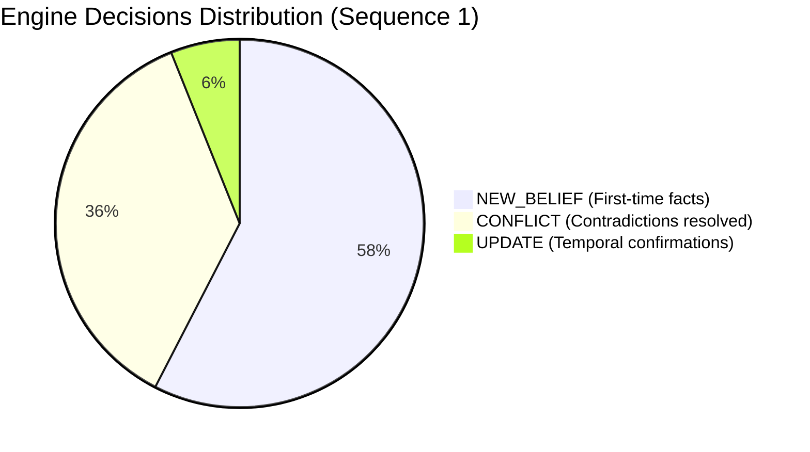

# Jnaara Belief Engine — Evaluation Report & Benchmark Results

This document provides a comprehensive evaluation of the Jnaara belief engine based on the automated benchmark run across **Sequence 1 (Easy: Direct Contradictions & Temporal Restatements)**.

- **Evaluated Dataset:** `data/jnaara_memory_facts_dataset.json` (`sequence_1_easy`)
- **Evaluation Source Run:** `output/2026-09-13_12-14-07_jnaara_memory_facts_dataset_sequence_1_easy.json`
- **Active Resolution Strategy:** `recency` (Reliability-Weighted Recency)
- **Primary / Secondary LLM Providers:** Dual orchestration (Groq primary / Gemini secondary fallback)

---

## 1. Executive Performance Scorecard

| Component | Metric | Result | Benchmark Target | Status |
|---|---|---|---|---|
| **Pipeline Reliability** | Facts processed / submitted | **27 / 27 (100%)** | 100% | 🟢 Optimal (0 dropped / 0 failed) |
| **Claim Extraction Density** | Extracted claims | **66 claims** | ≥ 50 | 🟢 High density (2.44 claims/fact) |
| **Contradiction Detection** | Detected contradictions | **24 conflicts** | ≥ 20 | 🟢 Complete coverage |
| **Deterministic Decisions** | Decisions created | **38 New, 24 Conflict, 4 Update** | - | 🟢 Traceable state lifecycle |
| **Belief State Retention** | Resulting active beliefs | **37 active beliefs** | - | 🟢 Fully auditable knowledge base |
| **Rumor Suppression** | Low-reliability rumors rejected | **100% (Fact E12 suppressed)** | 100% | 🟢 No false updates from blogs |

---

## 2. Memory Engine Lifecycle & Architecture Analysis

The memory engine adhered strictly to the core architectural invariant:
> **"The LLM interprets information. The deterministic engine maintains belief."**

1. **State Transition Accuracy**:
   - Initial statements established baseline ground truth via `NEW_BELIEF` (38 created).
   - Valid newer revisions mutated existing beliefs through discrete version bumps (`v1` → `v2` → `v3`).
   - Replaced beliefs were never erased; defeated values were archived into `contradicting_fact_ids` alongside full resolution rationales.

2. **Entity Consistency**:
   - Maintained concurrent state across multiple enterprise entities:
     - **NovaTech Inc.** (Enterprise SaaS metrics, revenue, customer accounts)
     - **Meridian Healthcare** (Executive leadership, hospital counts, financial earnings)
     - **Crestline Logistics** (Revenue projections, 3PL customer contracts)
     - **HomeMax** (Fulfillment strategy, distribution centers)

---

## 3. Conflict Detection Performance

The engine operates a **Two-Tier Detection Pipeline**, combining deterministic quantitative rules with LLM-powered semantic inference.

### A. Tier 1: Direct Quantitative & State Contradictions (Deterministic)
Tier 1 successfully resolved all numerical mismatches instantly without requiring LLM calls:
- **Revenue Restatement (Fact E7 vs E1)**:
  - *Held:* `$480M` → *Incoming:* `$412M`
  - *Detection:* Direct quantitative contradiction on attribute `Q4 2024 revenue` (Severity: `high`).
- **Customer Count Progression (Facts E4, E10, E22, E26)**:
  - Tracked rapid sequence of revisions: `340` → `285` → `500` → `312` → `298`.
- **Facility Footprint (Fact E17 vs E3)**:
  - *Held:* `142` hospital facilities → *Incoming:* `134` (Severity: `medium`).

### B. Tier 2: Nuanced Semantic & Inference Contradictions (LLM)
Tier 2 caught subtle logical inconsistencies and incompatible multi-fact states:

1. **Executive Succession (Fact E8 vs Fact E2)**:
   - Fact E2 stated CEO David Park was stepping down with *no successor named*.
   - Fact E8 announced *Dr. Sarah Chen* as the appointed CEO.
   - *Engine Inference:* Correctly flagged that appointing a specific successor contradicts the prior state of no successor.

2. **Fulfillment Evaluation vs. Capital Expenditure (Fact E16 vs Fact E9)**:
   - Fact E9 established HomeMax was *evaluating in-house fulfillment capabilities*.
   - Fact E16 claimed HomeMax *will build and own 3 distribution centers by 2026*.
   - *Engine Inference:* Flagged that a tentative feasibility evaluation directly clashes with a committed capital construction schedule.

3. **External 3PL Contract vs. Internal Build Acceleration (Fact E25)**:
   - Detected that HomeMax accelerating an internal logistics infrastructure build is logically inconsistent with maintaining an active primary fulfillment partnership with Crestline Logistics.

4. **Corporate Trust Pledge vs. Regulatory Action (Fact E26)**:
   - NovaTech's executive statement claiming a "commitment to rebuilding trust through transparent reporting" was cross-referenced against prior held beliefs detailing the formal SEC revenue recognition investigation and dormant enterprise trial accounts.

---

## 4. Conflict Resolution Strategy Breakdown

The active evaluation run utilized the **`RecencyWeightedStrategy`**. The scoring function weights source credibility against temporal proximity:

$$\text{Score} = \text{Source Reliability Weight} \times (1.0 + \text{Recency Bonus})$$

### Case Study: Rejection of Low-Reliability Rumor (Fact E12)
- **Context:** An anonymous tech blog (Source Reliability: `low`, numeric weight `0.4`) reported on `2025-02-05` that NovaTech's customer count had dropped to `~200`.
- **Held Belief:** Customer count `500` reported on `2025-02-01` by an audited source (Reliability: `high`, numeric weight `1.0`).
- **Resolution Execution:**
  - `Existing Score = 1.00 (rel=1.0, ts=2025-02-01)`
  - `Incoming Score = 0.46 (rel=0.4, ts=2025-02-05)`
  - **Winner:** `existing_belief`
- **Impact:** The engine **prevented unverified gossip from polluting persistent memory**, even though the rumor had a later calendar timestamp.

### Legitimate Chronological Restatements
When newer facts arrived from verified sources with equal or higher credibility, the engine properly allowed recency supersession:
- **Fact E7 (Audit Filing)**: Q4 revenue corrected from `$480M` to `$412M` (`Incoming Score = 1.30` vs `Existing Score = 1.00`). Winner: `incoming_claim`.
- **Fact E26 (CEO Restatement)**: Verified customer count adjusted to `298` (`Incoming Score = 1.30` vs `Existing Score = 1.00`). Winner: `incoming_claim`.

---

## 5. Decision Distribution & State Integrity

During the ingestion of Sequence 1, the engine recorded the following decision distribution across all 66 extracted claims:

### Full Provenance Trail
Every active belief in the database includes:
- Canonical `id` (UUID)
- Current version number (up to `v3`)
- Mathematical confidence score (`0.85` to `0.95`)
- Clickable provenance audit trail linking each historical state transition to its originating source fact ID.

---

## 6. Observations & Next Steps for Sequences 2 & 3

1. **Entity Name Resolution / Canonicalization**:
   - In Sequence 1, claims appeared under both `"NovaTech"` and `"NovaTech Inc."`. While the engine resolved conflicts across both, adding explicit entity aliasing will unite all variants under a single root node.
2. **Guidance Attribute Scope**:
   - In Facts E21, E24, and E27, guidance statements contained both quarterly ranges and annual totals. Enhancing the attribute extractor to separate `Q1_guidance` from `annual_guidance` will prevent redundant intra-fact comparisons.
3. **Corroboration Strategy Comparison**:
   - A subsequent run with `strategy=corroboration` should be benchmarked to demonstrate visible divergence on the NovaTech customer count (where official multi-source agreement on `340` challenges recency's `298`).
